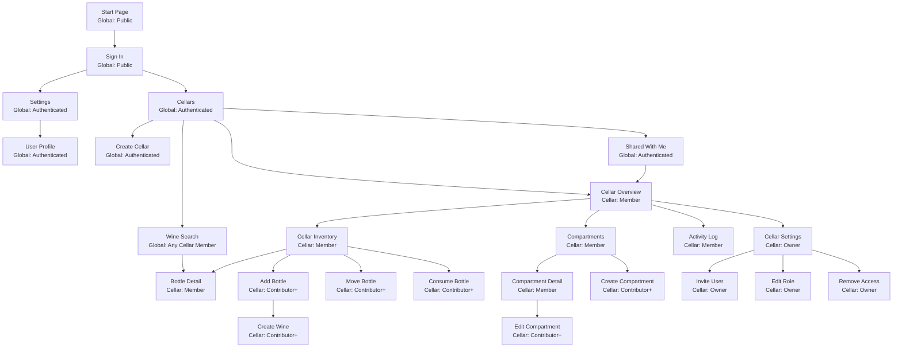

# Sitemap And Access Model

## Purpose

This document defines the application sitemap and the access model for pages and actions in the wine cellar application.

It separates:

- global access rules
- selected-cellar access rules
- role semantics
- page-level navigation

The sitemap reflects the current product assumptions:

- the application is multi-user
- cellar access is membership-based
- page access depends on either global authentication state or membership in a specific cellar
- bottle search is limited to bottles the user can access through cellar membership

## Access Scopes

The sitemap uses two access scopes.

### Global Scope

Global scope determines whether a user can access a page anywhere in the application, regardless of a currently selected cellar.

- `Public`: no authentication required
- `Authenticated`: any signed-in user
- `Any Cellar Member`: a signed-in user with membership in at least one cellar

### Cellar Scope

Cellar scope determines whether a user can access a page or action for a specific cellar.

- `Member`: the user has a role in the selected cellar as `OWNER`, `CONTRIBUTOR`, or `VIEWER`
- `Contributor+`: the user has role `CONTRIBUTOR` or `OWNER` in the selected cellar
- `Owner`: the user has role `OWNER` in the selected cellar

## Role Semantics

### VIEWER

- Can access cellar overview
- Can view cellar inventory
- Can view compartments
- Can open bottle detail
- Can view activity log
- Cannot add, move, consume, or remove bottles
- Cannot manage compartments
- Cannot manage cellar sharing or settings

### CONTRIBUTOR

- Has all `VIEWER` capabilities
- Can add bottles
- Can move bottles
- Can consume bottles
- Can create wines during bottle workflows
- Can create compartments
- Can edit compartments
- Cannot manage cellar membership or cellar-level settings reserved for owners

### OWNER

- Has all `CONTRIBUTOR` capabilities
- Can manage cellar settings
- Can invite users
- Can edit membership roles
- Can remove access

## Search Semantics

`Wine Search` is a cross-cellar bottle search, not a global wine master-data search.

Rules:

- It is only available to users who are members of at least one cellar
- Results must be limited to bottles the user can access through cellar membership
- Access to each result must still be valid for the bottle's cellar
- The search destination is `Bottle Detail`, not a separate wine-detail page

## Sitemap

## Page Inventory

- `Start Page`: public landing page
- `Sign In`: authentication entry point
- `Settings`: account-level settings entry point for signed-in users
- `User Profile`: account profile management
- `Cellars`: top-level cellar area for signed-in users
- `Create Cellar`: create a new cellar
- `Shared With Me`: list of cellars shared by other users
- `Wine Search`: search accessible bottles across all cellars the user can access
- `Cellar Overview`: entry page for a selected cellar
- `Cellar Inventory`: inventory view for bottles in the selected cellar
- `Bottle Detail`: detail page for a specific bottle the user can access
- `Add Bottle`: create a bottle inventory record in the selected cellar
- `Move Bottle`: change bottle location within a cellar
- `Consume Bottle`: mark a bottle as consumed
- `Create Wine`: create wine master data during bottle workflows
- `Compartments`: list compartments for the selected cellar
- `Compartment Detail`: detail view for one compartment
- `Create Compartment`: add a compartment to the selected cellar
- `Edit Compartment`: modify a compartment
- `Activity Log`: view cellar events and audit history
- `Cellar Settings`: owner-only cellar administration area
- `Invite User`: add a new cellar member
- `Edit Role`: change a member role
- `Remove Access`: remove cellar membership

## Route Inventory

The following route patterns are proposed for the application.

### Global Routes

- `/`: start page
- `/sign-in`: sign-in page
- `/settings`: settings entry point for authenticated users
- `/settings/profile`: user profile page
- `/cellars`: cellar landing page
- `/cellars/new`: create cellar page
- `/cellars/shared`: shared-with-me page
- `/search/bottles`: cross-cellar bottle search for any cellar member

### Cellar Routes

- `/cellars/:cellarId`: cellar overview
- `/cellars/:cellarId/inventory`: cellar inventory
- `/cellars/:cellarId/compartments`: compartments list
- `/cellars/:cellarId/activity`: activity log
- `/cellars/:cellarId/settings`: cellar settings

### Bottle Routes

- `/cellars/:cellarId/bottles/:bottleId`: bottle detail
- `/cellars/:cellarId/bottles/new`: add bottle
- `/cellars/:cellarId/bottles/:bottleId/move`: move bottle
- `/cellars/:cellarId/bottles/:bottleId/consume`: consume bottle

### Wine Routes

- `/cellars/:cellarId/wines/new`: create wine during bottle workflows

### Compartment Routes

- `/cellars/:cellarId/compartments/new`: create compartment
- `/cellars/:cellarId/compartments/:compartmentId`: compartment detail
- `/cellars/:cellarId/compartments/:compartmentId/edit`: edit compartment

### Membership Routes

- `/cellars/:cellarId/settings/members/invite`: invite user
- `/cellars/:cellarId/settings/members/:membershipId/role`: edit role
- `/cellars/:cellarId/settings/members/:membershipId/remove`: remove access

## Routing Rules

- Global routes must not require a selected cellar unless the route contains `:cellarId`
- Cellar routes must validate membership for the referenced `:cellarId`
- Bottle routes must validate both cellar membership and bottle-to-cellar ownership
- `Bottle Detail` should remain nested under a cellar route even when reached from global search
- Cross-cellar search results should link directly to the canonical bottle route:
  - `/cellars/:cellarId/bottles/:bottleId`
- Mutating routes must enforce `Contributor+` or `Owner` server-side even if UI navigation hides them
- Owner-only membership management routes must enforce `Owner` server-side

## Enforcement Notes

- Global navigation must not expose cellar pages unless the required access scope is satisfied
- Cellar-scoped pages must validate membership for the currently selected cellar
- Contributor-only and owner-only actions must be enforced server-side, not only hidden in the UI
- Search results must be authorization-filtered before they are returned
- Page visibility and action permission are related but not identical; detail pages may be visible to `VIEWER` while mutations require `Contributor+` or `Owner`
